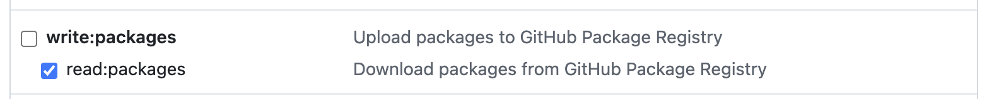

## Cloudwalk Solidity Project Setup

## Using internal NPM Packages

To use GitHub NPM packages, you need to authenticate your npm client with the GitHub npm registry. This only needs to be done once.

For step-by-step instructions, refer to the [GitHub documentation on authenticating with a personal access token](https://docs.github.com/en/packages/working-with-a-github-packages-registry/working-with-the-npm-registry#authenticating-with-a-personal-access-token).

**Quick Start:**

1. Generate a personal access token [here](https://github.com/settings/tokens). We need to choose `Personal access tokens (classic)` with `read:packages` permission.


2. Run the following command in your terminal:
```bash
$ npm login --scope=@cloudwalk --auth-type=legacy --registry=https://npm.pkg.github.com

> Username: USERNAME
> Password: TOKEN
```
3. Authorize the new token with Cloudwalk SSO

## Play with repo

1. Clone the repo.
1. Create the `.env` file based on the `.env.example` one:
   - Windows:

   ```sh
   copy .env.example .env
   ```

   - MacOS/Linux:

   ```sh
   cp .env.example .env
   ```

1. Optionally update the settings in the newly created `.env` file (e.g., Solidity version, number of optimization runs, network RPC URLs, private keys (PK) for networks, etc.).
1. Optional: [Setup npm token](https://github.com/cloudwalk/brlc-dev-ex?tab=readme-ov-file#using-npm-packages). If you need development tools, like linters.
## Build and test

```sh
# Install all dependencies
npm i

# Compile all contracts
npm run build

# Run all tests
npm run test
```